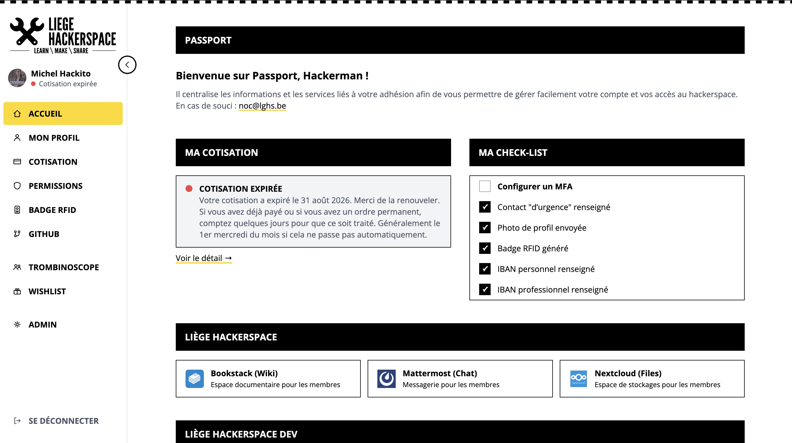

# Passport3

*[Read this in English](README.md)*

Passport3 est le portail des membres du [Liège Hackerspace](https://lghs.be).

Il offre une interface unique et conviviale permettant aux membres de gérer leur identité, leur adhésion, leurs cotisations, leurs droits d'accès et d'autres informations liées au hackerspace.

Passport3 sert d'interface personnalisée pour plusieurs services internes, notamment :

- **Authentik** pour l'authentification et la gestion d'identité
- **Dolibarr** pour les adhésions, cotisations et paiements
- **GitHub** pour demander l'accès à l'organisation du hackerspace
- **Les systèmes de contrôle d'accès** pour l'accès physique au hackerspace
- D'autres services communautaires et de gestion des membres



## Objectifs

Passport3 vise à offrir aux membres un endroit central pour :

- [x] Consulter et mettre à jour leurs informations personnelles
- [x] Vérifier le statut de leur adhésion
- [x] Consulter leurs cotisations passées et en cours, y compris les paiements manquants ou irréguliers
- [x] Gérer l'authentification et les paramètres de sécurité (sessions actives, appareils MFA)
- [x] Gérer leurs badges ou identifiants d'accès (UUID du badge RFID)
- [x] Demander l'accès à l'organisation GitHub du hackerspace
- [x] Accéder à l'annuaire des membres et au trombinoscope
- [x] Choisir quelles informations sont visibles par les autres membres
- [x] Gérer ses contacts d'urgence
- [x] Consulter ses propres permissions et groupes d'appartenance
- [x] Consulter l'historique des actions effectuées sur son compte, par soi-même ou par un admin
- [x] Partager la liste des tâches de l'atelier : proposer, rejoindre et suivre des tâches
- [ ] Accéder aux informations de paiement et de comptabilité
- [ ] Voir leurs droits d'accès physique
- Accéder aux futurs services du hackerspace via une interface unifiée

## Intégrations

### Authentik

Authentik est utilisé comme fournisseur d'identité et backend d'authentification.

Passport3 fournit une interface personnalisée pour les membres tout en s'appuyant sur Authentik pour :

- L'authentification
- Le Single Sign-On
- Les identités utilisateur
- Les groupes et rôles
- La sécurité et la gestion des sessions

### Dolibarr

Dolibarr est utilisé pour la gestion administrative et financière des adhésions.

Passport3 communique avec Dolibarr pour récupérer ou gérer :

- Les fiches des membres
- Les cotisations d'adhésion
- Les dates d'expiration des cotisations
- Les paiements
- Les factures et documents justificatifs
- Le statut administratif d'adhésion
- Les coordonnées bancaires personnelles et professionnelles (IBAN)

### GitHub

Passport3 permet aux membres de demander eux-mêmes l'accès à l'organisation GitHub du hackerspace, sans passer par un·e admin.

Le processus repose sur deux identifiants séparés, chacun avec le minimum de droits nécessaires :

- Une **OAuth App GitHub** vérifie que le membre possède réellement le compte GitHub qu'il souhaite lier (simple vérification d'identité en lecture seule, aucun accès à l'organisation).
- Une **GitHub App**, installée sur l'organisation avec uniquement la permission "Members: Read and write", est le seul identifiant privilégié qui envoie réellement l'invitation une fois l'identité confirmée.

Un membre ne peut lier et inviter que son propre compte — jamais celui de quelqu'un d'autre — et peut voir s'il est déjà membre, déjà invité, ou ni l'un ni l'autre.

### Contrôle d'accès

Passport3 fait l'interface entre les membres et l'infrastructure de contrôle d'accès du hackerspace.

Selon le matériel et la configuration déployés, cela peut inclure :

- La consultation des droits d'accès
- La gestion des badges ou identifiants d'accès
- La demande ou l'activation d'un accès
- La consultation du statut d'un identifiant
- La révocation d'un identifiant perdu
- La synchronisation des droits d'accès avec le statut d'adhésion

### Panneau d'administration

Un panneau d'administration restreint (réservé à un groupe Authentik dédié) permet à des membres désigné·es de :

- Lister et rechercher les comptes membres, en voyant d'un coup d'œil qui a activé le MFA et renseigné un contact d'urgence
- Modifier le profil d'un membre en son nom
- Modifier la visibilité trombinoscope et le rôle affiché (tag court et rôle étendu) d'un membre en son nom
- Voir les méthodes MFA d'un membre
- Gérer les contacts d'urgence d'un membre en son nom
- Régénérer le badge RFID d'un membre en son nom
- Créer des invitations d'inscription pour de nouveaux membres
- Consulter l'historique complet des actions admin et membres

### Historique d'audit

Passport3 conserve un historique des actions effectuées via l'application, aussi bien par les admins (modification du profil d'un membre, création d'une invitation) que par les membres sur leur propre compte (mise à jour du profil, révocation d'une session, changement de coordonnées bancaires). Chaque entrée enregistre qui a fait quoi, quand, et les valeurs avant/après quand c'est pertinent.

- Les admins peuvent consulter l'historique sur `/admin/audit`, avec recherche, pagination et une vue de différences montrant précisément ce qui a changé. La v1 ne couvre que les 200 actions les plus récentes de toute l'application, pas l'historique complet
- Les membres peuvent consulter l'historique de leur propre compte sur `/profile`, y compris les changements faits par un admin en leur nom, par transparence
- Certains champs ne sont volontairement jamais enregistrés, même dans l'historique : les contacts d'urgence (données personnelles de tiers) et l'UUID du badge RFID (un identifiant d'accès physique) sont journalisés comme "modifiés", jamais avec leur valeur réelle
- Les actions effectuées directement dans un autre système (ex. un IBAN modifié directement dans Dolibarr) n'y apparaissent pas, seul ce qui passe par Passport3 lui-même est capturé
- L'écriture d'une entrée se fait en best-effort : une action déjà réussie n'échoue jamais juste parce que l'écriture du log elle-même a échoué. C'est un historique informatif pour la transparence, pas un journal de conformité avec garanties de nouvelle tentative ou d'alerte
- Les IBAN bancaires sont journalisés avec leur vraie valeur avant/après (le cas phare pour lequel cette fonctionnalité existe), consultable comme n'importe quelle autre entrée : par les admins sur `/admin/audit`, et par le membre lui-même dans son propre historique `/profile`. Il n'y a pas encore de limite de conservation ni de politique de purge

### Tâches de l'atelier

`/tasks` remplace les post-its sur le mur de l'atelier : une liste de tâches partagée pour le hackerspace.

- **Vue tableau ou liste**, colonnes *À faire* / *En cours* / *Fait*, plus *Bloqué* (masquée par défaut, mise en avant quand elle n'est pas vide). Filtres : « Mes tâches », recherche, priorité, leader. Les tâches faites quittent le tableau après 30 jours
- **Glisser-déposer** une carte vers une autre colonne (à la souris) : ça déclenche les mêmes actions que les boutons de la tâche, donc mêmes droits, même historique, même audit. Déposer sur *Bloqué* ouvre la tâche, car un blocage demande une note
- **Tout membre peut ajouter une tâche** (titre, description en mini-markdown, date limite facultative, priorité de *Bas* à *Urgent*) ; son auteur en est le **propriétaire**
- **Personnes sur une tâche** : les membres se portent volontaires (*participant*, peut se retirer à tout moment, aussi via le « + » d'une carte) ou y sont mis par un admin, le propriétaire ou le leader (*assigné*, prévenu en message privé Mattermost, ne peut pas se retirer lui-même). L'un d'eux peut être le **leader** (★)
- **Le propriétaire et le leader gèrent la tâche** avec les admins : assigner ou retirer des personnes, la bloquer ou la débloquer, la supprimer (un leader ne peut pas supprimer une tâche créée par un admin). Les boutons réservés aux admins sont jaunes
- **Étapes explicites** : avoir des personnes sur une tâche ne la démarre pas, c'est *Démarrer* qui la passe *En cours*. *Bloqué* demande un type (interne/externe) et une note sur ce qu'on attend
- **Historique et commentaires propres à chaque tâche** dans sa fiche ; chaque action est aussi écrite dans le journal d'audit, visible sur `/admin/audit` et dans l'historique du membre
- **Rappels Mattermost** (vérification toutes les heures à partir de 9 h, heure de Bruxelles) : un message « à faire pour demain » et un « date limite dépassée » par date limite, envoyés aux personnes sur la tâche (au propriétaire s'il n'y a personne) ; les tâches bloquées sont ignorées
- **Annonces sur un canal** (Admin → Paramètres → Todolist, chacune désactivée par défaut) : nouvelles tâches, tâches terminées, tâches qui deviennent bloquées, tâches passées en urgent (une nouvelle tâche urgente n'est annoncée qu'une fois, comme urgente), et un récap hebdomadaire (jour et heure réglables, lundi 9 h par défaut) des tâches urgentes à faire dans les 7 jours, en retard et sans participant, postés sur le canal choisi
- **Liens directs** : `/tasks?task=<id>` ouvre une tâche, et les messages Mattermost y renvoient. Passport n'a pas de réglage d'adresse publique dédié : ces liens utilisent l'origine de `AUTHENTIK_REDIRECT_URI`, qui doit donc pointer vers l'adresse publique de Passport
- La page d'accueil liste les tâches ouvertes du membre (« Mes tâches »)

Prévu ensuite : tâches récurrentes avec tour de rôle entre membres, relecture des tâches faites, vue plein écran / API pour l'écran TV de l'atelier.

## Fonctionnalités prévues

- Historique des paiements
- Téléchargement de factures et documents
- Gestion de l'accès physique
- Préférences de notification
- API pour les autres services du hackerspace

## Vie privée

Passport3 traite des données personnelles appartenant aux membres du hackerspace.

Le projet suit les principes suivants :

- Minimisation des données
- Finalité explicite
- Accès selon le moindre privilège
- Transparence envers l'utilisateur
- Conservation limitée
- Stockage sécurisé
- Visibilité contrôlée par le membre

Les informations privées des membres ne doivent jamais être exposées via l'annuaire ou les API sans règle d'autorisation explicite.

## Déploiement preprod

`docker-compose.yml` construit l'image depuis les sources (dev local). `docker-compose.preprod.yml` récupère à la place l'image construite par la CI (`.github/workflows/docker-release.yml`) depuis GHCR, et lance Watchtower en parallèle pour la mettre à jour automatiquement à chaque nouvelle version.

Le package `ghcr.io/lghs/passport3` est **public**, donc aucune connexion au registre n'est nécessaire, ni sur l'hôte preprod ni pour Watchtower. Après la toute première release (le package n'existe pas dans GHCR avant ça), passez sa visibilité en public une fois, depuis l'onglet Packages du repo (Package settings → Change visibility).

Mise en place sur l'hôte preprod :

```bash
docker compose -f docker-compose.preprod.yml up -d
```

Publier une nouvelle version (`git tag vX.Y.Z && git push --tags`, ou `gh release create vX.Y.Z`) construit et pousse `ghcr.io/lghs/passport3:X.Y.Z` et `ghcr.io/lghs/passport3:preprod` — Watchtower détecte la mise à jour du tag `preprod` dans les 5 minutes et redéploie automatiquement.

### Stockage de données local

Passport3 garde une petite base PostgreSQL pour les données qui n'ont pas leur place dans Authentik, Dolibarr ou GitHub — par exemple l'historique d'audit des actions admin et membres, la wishlist, les tâches de l'atelier, et les réglages du planificateur d'anniversaires. `docker-compose.yml` et `docker-compose.preprod.yml` lancent chacun leur propre conteneur `postgres` (celui de `docker-compose.yml` est aussi accessible depuis l'hôte sur `127.0.0.1:5432`, pour `pnpm dev` lancé hors Docker ; celui de preprod est interne uniquement, jamais exposé sur l'hôte), sur son propre volume nommé (`passport3-postgres-data`) pour qu'il survive à la recréation du conteneur — y compris un redéploiement déclenché par Watchtower. Définissez `POSTGRES_USER`, `POSTGRES_PASSWORD` et `POSTGRES_DB` dans `.env` (voir `.env.example`) avant de le démarrer. **Ce volume contient désormais de la donnée réelle et non reconstructible, à inclure dans la routine de sauvegarde de l'hôte** — contrairement au reste du conteneur, jusqu'ici entièrement stateless et jetable.

Sauvegardez-le avec `pg_dump`, par exemple :

```bash
docker exec passport3-postgres pg_dump -U passport3 passport3 > backup.sql
```

Les photos de profil envoyées par les membres vivent séparément, dans leur propre volume nommé (`passport3-data`, sur `/app/data`), dans `avatars/` (JPEG 512×512 nommés d'après le hash md5 de l'email du membre) — **les deux volumes doivent être sauvegardés**, pas seulement celui de la base. Les avatars n'utilisent pas la base du tout : le fichier lui-même indique si un membre a envoyé une photo, et la couleur de ses initiales générées est un attribut Authentik (`avatar_color`), donc une panne Postgres ne les affecte jamais. Passport est son propre service d'avatars : Gravatar n'est plus utilisé du tout. Les URL d'avatar sont publiques, construites comme celles de Gravatar (`/avatars/<md5 de l'email en minuscules>.jpg`), et renvoient toujours une image : la photo envoyée par le membre, sinon une image de ses initiales (les deux premiers caractères de son nom d'utilisateur, sur un fond sobre choisi d'après son hash ou par le membre), générée au premier appel avec [resvg](https://github.com/thx/resvg-js) puis mise en cache dans `avatars/generated/`. Les réponses portent un ETag avec `Cache-Control: no-cache`, donc une nouvelle photo ou couleur apparaît immédiatement partout, tandis qu'un avatar inchangé ne coûte qu'un 304 sans corps. D'autres services peuvent s'en servir comme source d'avatar :

- **Authentik**, *System → Settings → Avatars* : `https://<passport>/avatars/%(mail_hash)s.jpg`
- **BookStack** : `AVATAR_URL=https://<passport>/avatars/${hash}.jpg`

Le conteneur `passport3` tourne avec un système de fichiers en lecture seule, sans capacités Linux et avec `no-new-privileges` (voir `docker-compose*.yml`) : seuls le volume d'avatars et un `/tmp` en mémoire sont inscriptibles, et le dossier de données n'est lisible que par l'utilisateur `passport`.

Les tables sont créées par des migrations numérotées et append-only dans `src/lib/server/migrations.ts` (exécutées automatiquement à la première connexion) plutôt que par chaque module de fonctionnalité créant sa propre table — ajoutez une nouvelle entrée là-bas pour une nouvelle table plutôt qu'un `CREATE TABLE IF NOT EXISTS` local.

## Contribuer

Les contributions sont les bienvenues.

Passport3 est développé pour la communauté du Liège Hackerspace. Les problèmes, suggestions et pull requests peuvent être soumis via le dépôt du projet.

Merci de ne jamais inclure de données personnelles de membres, d'identifiants, de clés API ou de configuration de production dans les issues ou contributions.

Toute nouvelle fonctionnalité qui modifie le compte d'un membre ou une donnée admin doit appeler `logAuditEvent()` (`src/lib/server/auditLog.ts`), comme le fait déjà chaque action existante, voir la section [Historique d'audit](#historique-daudit) plus haut.

## Nom du projet

Passport3 est la troisième génération du portail des membres du Liège Hackerspace.

Le nom reflète sa vocation : offrir aux membres une identité unique et un point d'entrée vers l'écosystème du hackerspace.
