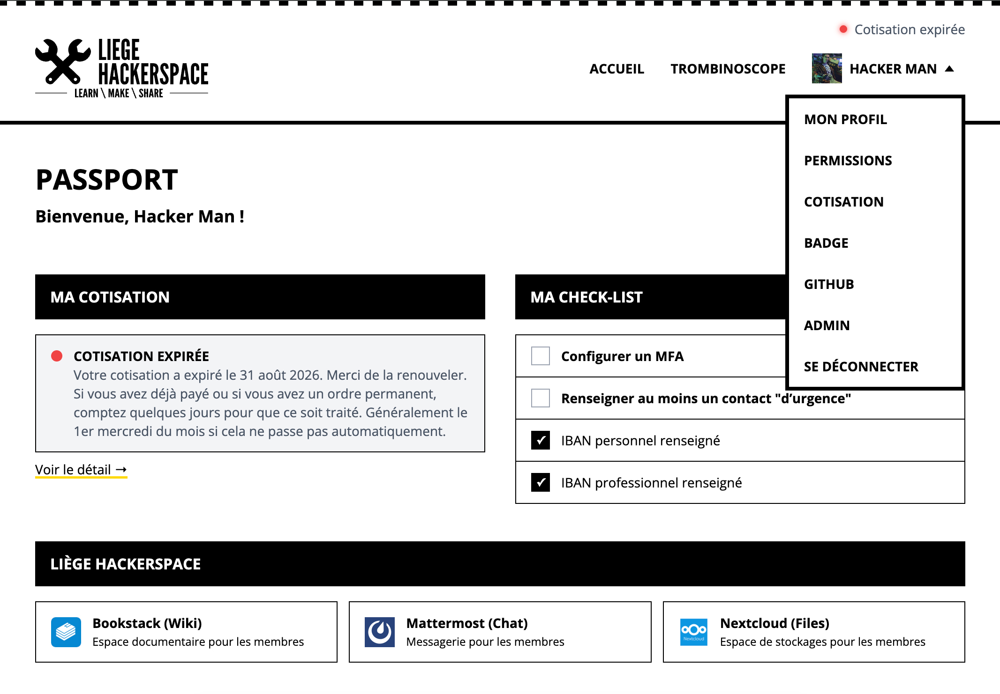

# Passport3

*[Lire en français](README.fr.md)*

Passport3 is the member portal of the [Liège Hackerspace](https://lghs.be).

It provides a single, user-friendly interface for members to manage their identity, membership, subscriptions, access rights, and other information related to the hackerspace.

Passport3 acts as a custom frontend for several internal services, including:

- **Authentik** for authentication and identity management
- **Dolibarr** for memberships, subscriptions, and payments
- **GitHub** for requesting access to the hackerspace's organization
- **Access control systems** for physical access to the hackerspace
- Additional community and member-management services



## Goals

Passport3 aims to provide members with one central place to:

- [x] View and update their personal information
- [x] Check their membership status
- [x] View current and previous subscriptions, including missing or irregular payments
- [x] Manage authentication and security settings (active sessions, MFA devices)
- [x] Manage badges or access credentials (RFID badge UUID)
- [x] Request access to the hackerspace's GitHub organization
- [x] Choose which information is visible to other members
- [x] Access the member directory and phonebook
- [x] Manage emergency contacts
- [x] View their own permissions and group memberships
- [x] View a history of actions taken on their account, by themselves or by an admin
- [ ] Access payment and accounting information
- [ ] View their physical access permissions
- Access future hackerspace services through a unified interface

## Integrations

### Authentik

Authentik is used as the identity provider and authentication backend.

Passport3 provides a custom member-facing interface while relying on Authentik for:

- Authentication
- Single Sign-On
- User identities
- Groups and roles
- Security and session management

### Dolibarr

Dolibarr is used for administrative and financial membership management.

Passport3 communicates with Dolibarr to retrieve or manage:

- Member records
- Membership subscriptions
- Subscription expiration dates
- Payments
- Invoices and supporting documents
- Administrative membership status
- Personal and professional bank account details (IBAN)

### GitHub

Passport3 lets members request access to the hackerspace's GitHub organization themselves,
without going through an admin.

The flow is split into two independent, minimally-scoped credentials:

- A **GitHub OAuth App** verifies that a member really owns the GitHub account they want to link
  (read-only identity check, no organization access).
- A **GitHub App**, installed on the organization with only the "Members: Read and write"
  permission, is the one privileged credential that actually sends the invitation once identity is
  confirmed.

A member can only ever link and invite their own account — never someone else's — and can see
whether they're already a member, already invited, or neither.

### Access Control

Passport3 provides an interface between members and the hackerspace access-control infrastructure.

Depending on the deployed hardware and configuration, it may support:

- Viewing access permissions
- Managing badges or access credentials
- Requesting or activating access
- Viewing credential status
- Revoking lost credentials
- Synchronizing access rights with membership status

### Admin panel

A restricted admin panel (gated behind an Authentik group) lets designated members:

- List and search member accounts
- Edit a member's profile on their behalf
- Edit a member's trombinoscope visibility and displayed role on their behalf
- Manage a member's emergency contacts on their behalf
- Regenerate a member's RFID badge on their behalf
- Create onboarding invitations for new members
- View a full audit history of admin and member actions

### Audit log

Passport3 keeps a log of actions taken through the app, both by admins (editing a member's
profile, creating an invitation) and by members on their own account (updating their profile,
revoking a session, changing bank info). Each entry records who did what, when, and the before/after
values where relevant.

- Admins can browse the log at `/admin/audit`, searchable and paginated, with a diff view showing
  exactly what changed — v1 only covers the 200 most recent events across the whole app, not the
  full history
- Members can see their own account's history on `/profile`, including changes made by an admin on
  their behalf, for transparency
- Some fields are deliberately never recorded even as history — emergency contacts (third-party
  personal data) and the badge RFID UUID (a physical-access credential) are logged as "changed", never
  with their actual value
- Actions performed directly in another system (e.g. an IBAN edited straight in Dolibarr) aren't
  captured — only what goes through Passport3 itself
- Writing an entry is best-effort: an already-successful action is never failed just because the
  log write itself failed. This is an informational log for transparency, not a compliance-grade
  audit trail with retry/alerting guarantees
- Bank IBANs are logged with their real before/after value (the flagship case this feature exists
  for), viewable the same way as any other entry — by admins in `/admin/audit`, and by the member
  themselves in their own `/profile` history. There is no retention limit or purge policy yet

## Planned Features

- Payment history
- Invoice and document downloads
- Physical access management
- Notification preferences
- API for other hackerspace services

## Privacy

Passport3 processes personal data belonging to hackerspace members.

The project follows the principles of:

- Data minimization
- Explicit purpose
- Least-privilege access
- User transparency
- Limited retention
- Secure storage
- Member-controlled visibility

Private member information must never be exposed through the directory or APIs without an explicit authorization rule.

## Preprod deployment

`docker-compose.yml` builds from source (local dev). `docker-compose.preprod.yml` instead pulls
the image built by CI (`.github/workflows/docker-release.yml`) from GHCR and runs Watchtower
alongside it to auto-update whenever a new version is released.

The `ghcr.io/lghs/passport3` package is **public**, so no registry login is needed anywhere —
neither on the preprod host nor for Watchtower. After the very first release (the package doesn't
exist in GHCR until then), set its visibility to public once under the repo's Packages tab
(Package settings → Change visibility).

Setup on the preprod host:

```bash
docker compose -f docker-compose.preprod.yml up -d
```

Releasing a new version (`git tag vX.Y.Z && git push --tags`, or `gh release create vX.Y.Z`)
builds and pushes `ghcr.io/lghs/passport3:X.Y.Z` and `ghcr.io/lghs/passport3:preprod` — Watchtower
picks up the `preprod` tag update within 5 minutes and redeploys automatically.

### Local data storage

Passport3 has a small local SQLite database (`better-sqlite3`) for data that has no home in
Authentik, Dolibarr, or GitHub — e.g. the audit trail of admin and member actions. Both `docker-compose.yml`
and `docker-compose.preprod.yml` mount it on a named volume (`passport3-data`, at `/app/data`), set
via the `DB_PATH` environment variable, so it survives container recreation — including a
Watchtower-triggered redeploy. **This volume now holds real, non-reconstructible data and needs to
be included in whatever backup routine the host already has** — unlike the rest of the container,
which was previously fully stateless and disposable.

The database runs in WAL mode, so `passport3.db` alone is not a consistent snapshot while the
container is running — recent transactions can still be sitting in `passport3.db-wal`. Either stop
the container before copying just the `.db` file, or back up the whole volume (`.db`, `.db-wal`,
`.db-shm` together) in one atomic snapshot.

Uploaded profile photos live in the same volume, under `avatars/` next to the database (256×256
JPEGs with random file names, indexed by the `member_avatars` table) — back them up together.
The container runs with a read-only filesystem, no Linux capabilities and `no-new-privileges`
(see `docker-compose*.yml`): the data volume and a `/tmp` tmpfs are the only writable places, and
the data directory is readable only by the `passport` user.

Tables are created by numbered, append-only migrations in `src/lib/server/migrations.ts` (run
automatically on first connection) rather than by each feature module creating its own table ad
hoc — add a new entry there for a new table instead of a local `CREATE TABLE IF NOT EXISTS`.

## Contributing

Contributions are welcome.

Passport3 is developed for the Liège Hackerspace community. Issues, suggestions, and pull requests can be submitted through the project repository.

Please do not include personal member data, credentials, API keys, or production configuration in issues or contributions.

Any new feature that mutates a member's account or admin-side data should call `logAuditEvent()` (`src/lib/server/auditLog.ts`), the same way every existing action does — see the [Audit log](#audit-log) section above.

## Project Name

Passport3 is the third generation of the Liège Hackerspace member portal.

The name reflects its purpose: providing members with a single identity and entry point to the hackerspace ecosystem.
